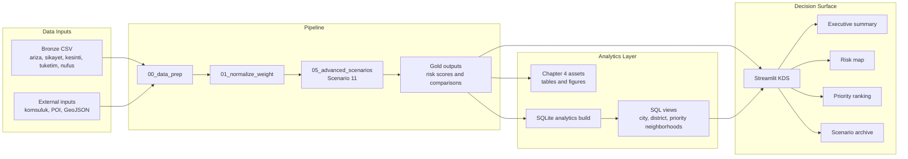

# Project Architecture

Bu doküman, İSKİ risk önceliklendirme projesinin karar destek akışını ve portfolio açısından güçlü taraflarını özetler. Proje bir tahmin modeli değil, mahalle bazında açıklanabilir risk sıralaması üreten analitik karar destek hattıdır.

## Data Pipeline and Decision Flow

## What Is Already Done

| Area | Completed work | Files |
| --- | --- | --- |
| Decision model | Scenario 11 PoF/CoF risk scoring is the final source of truth | `pipeline/05_advanced_scenarios.py` |
| Executive dashboard | Streamlit KDS has manager-friendly summary, map, ranking and archive tabs | `app/main.py` |
| Analytical helpers | City, district, distribution, top-neighborhood and data-quality summaries are separated from UI code | `src/analysis/executive_summary.py` |
| SQL layer | SQLite build script loads curated outputs and applies reusable views | `scripts/build_analytics_sqlite.py`, `sql/views/` |
| Reporting outputs | Chapter 4 tables and figures are generated from the model outputs | `scripts/reporting/generate_chapter4_assets.py`, `outputs/chapter4/` |
| CI and checks | GitHub Actions compiles Python, runs tests and builds SQLite analytics layer | `.github/workflows/ci.yml` |

## Realistic Next Backlog

| Priority | Work | Why it matters |
| --- | --- | --- |
| P1 | Metric dictionary for risk KPIs | PoF, CoF, risk score and risk bands should be defined in one auditable place. |
| P1 | Map join quality table | The map exists; the next useful step is showing matched, unmatched and duplicate geography counts in the dashboard. |
| P1 | SQLite reconciliation check | Confirms SQL view totals match `outputs/chapter4` city and district summaries. |
| P2 | District drill-down summary | Makes the dashboard more useful for non-technical review by district managers. |
| P2 | Pipeline run summary | Records row counts, generated files and warnings after each run. |
